# rock-and-roll-marathon-project

# Introduction
For this project, I was assigned with finding top run times for the Nashville rock and roll marathon for the years 2016-2019, along with any other interesting insights I found along the way. This included both half marathons and full marathons. For this project I used Excel.

Data sources: All the data for this project was provided by [Rock 'N' Roll Nashville](https://www.runrocknroll.com/contact)
# Table of Contents
* [Introduction](#Introduction)
* [Excel Walkthrough](#Excel-Walkthrough)

# Excel Walkthrough

1. The first step was to put a filter on the Excel sheets in order to find which marathon runners were faster or slower during every marathon. There are eight Excel sheets, one for each full and half marathon. Sadly I am not able to show the full datasets, due to the nature of the runner's information being visible.

2. For the second step I needed to find the fastest time for each of the eight marathons, and for this step, I use the `MIN` function.

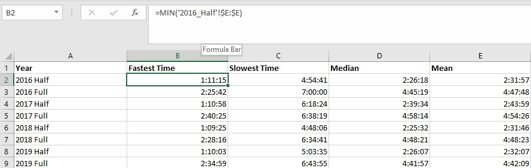

3. For the third step I needed to find the slowest time for each of the eight marathons, and for this step, I use the `MAX` function.

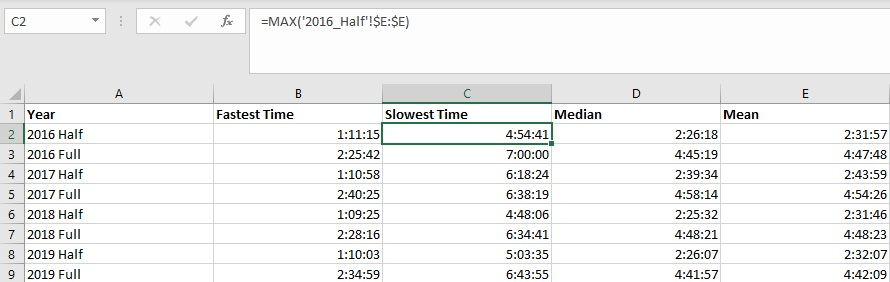

4. For the fourth step I needed to find the median time for each of the eight marathons, and for this step, I use the `MEDIAN` function.

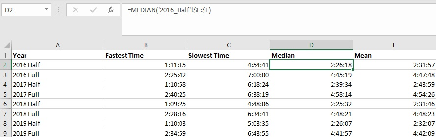

5. For the fifth step I needed to find the average time for each of the eight marathons, and for this step, I use the `AVERAGE` function.

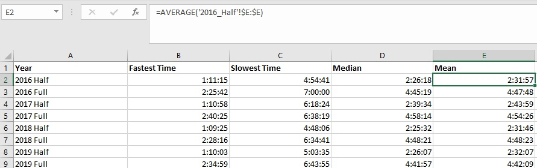

6. For the sixth step I needed to find the median time for all of the half and full marathons, and for this step I use the `MEDIAN` function, making sure to include every full marathon sheet in each function.

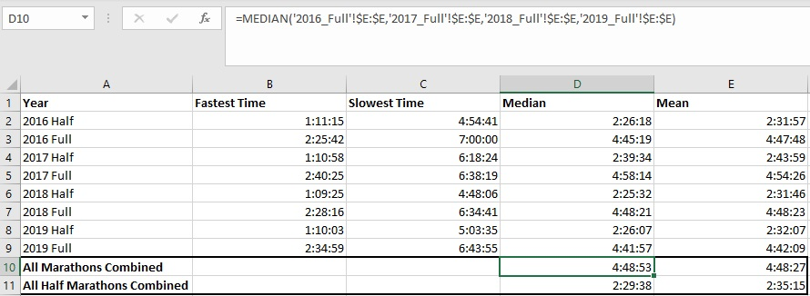

7. For the seventh step I needed to find the average time for all of the half and full marathons, and for this step I use the `AVERAGE` function, making sure to include every full marathon sheet in each function.

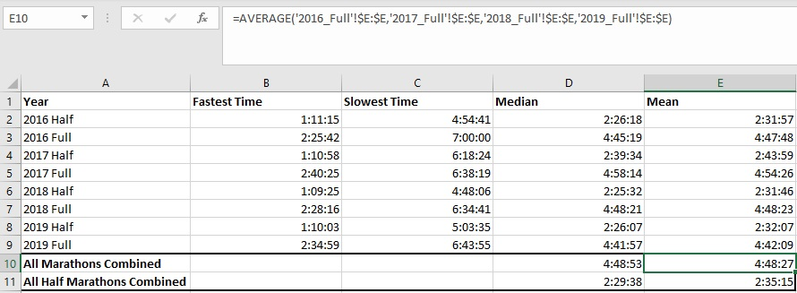

8. For a full Rock and roll marathon, first-time marathoners sometimes set a goal of beating "Oprah's time," whose time is (04:29:29) in the 1994 Marine Corps Marathon at age 40. The next two steps will be covering the number of runners who beat her time, and the percentage of runners who beat her time.

9. In this step I found how many runners beat Oprah's time for all four full marathons, and I used the `COUNTIF` function with the criteria that the time had to be less than (04:29:29).

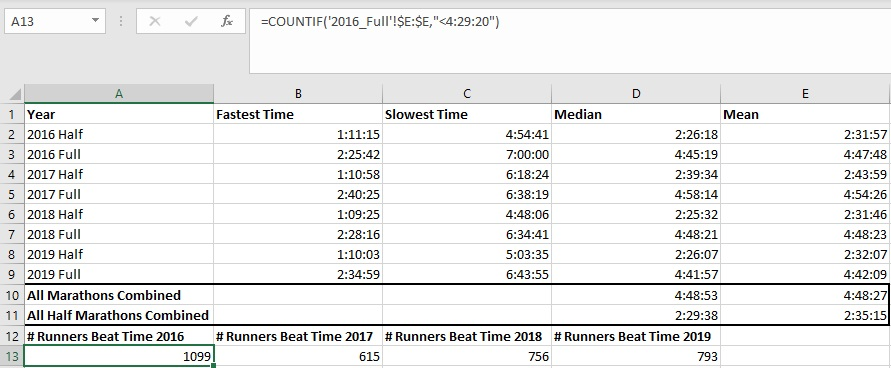

10. For this step I found the percentage of runners who beat Oprah's time for all four full marathons, and I divided the number of runners who beat Oprah's time that was calculated in the previous step and divided by the number of participants in each marathon.

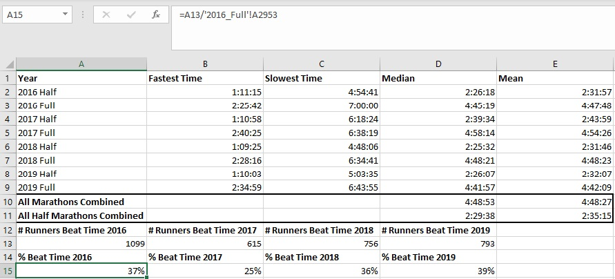

11. For the next few steps I needed to find the interquartile range for each of the half marathons. For the first quartile I use the function `QUARTILE.INC` and for the quartile argument, I put the number 3, as the range we want to find is based on the time the marathon was completed.

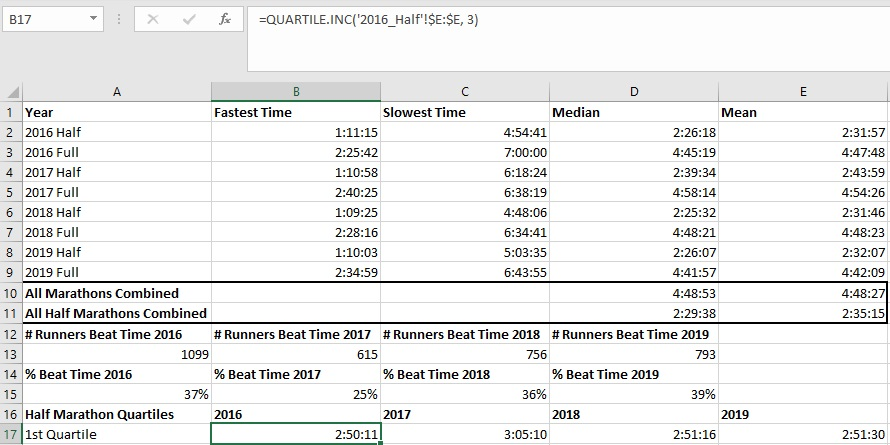

12. In this step I need to find the second quartile for the half marathons, so I again use the function `QUARTILE.INC` and change the quartile argument to the number 2, which should be the same time as the median times in which the marathons were completed.

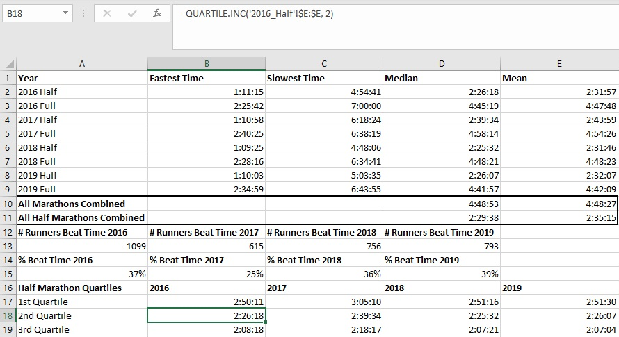

13. In this step I need to find the third quartile for the half marathons, so I again use the function `QUARTILE.INC` and change the quartile argument to the number 1, which should represent some of the top times in which the marathons were completed.

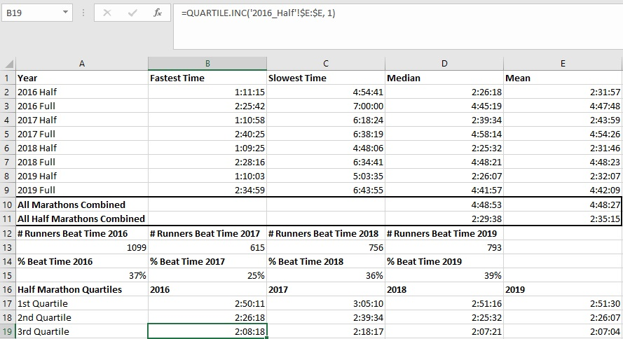

14. Scott Wietecha has won first place in every single full marathon in the past seven years, so when analyzing the data, I wanted to see if there were any differences in the time it takes him to complete each marathon. So we'll start by collecting his time and comparing it to second place.

15. For this step I took Scott's time for each year by referencing the top runner in each of the full marathon Excel sheets.

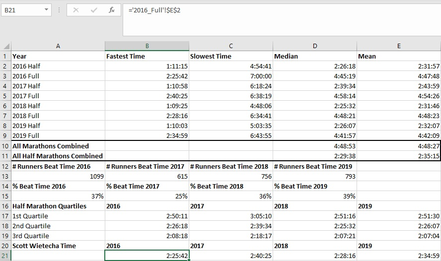

16. The next step is similar to the last, as I took the second place time for each year by referencing the second place runner in each of the full marathon Excel sheets.

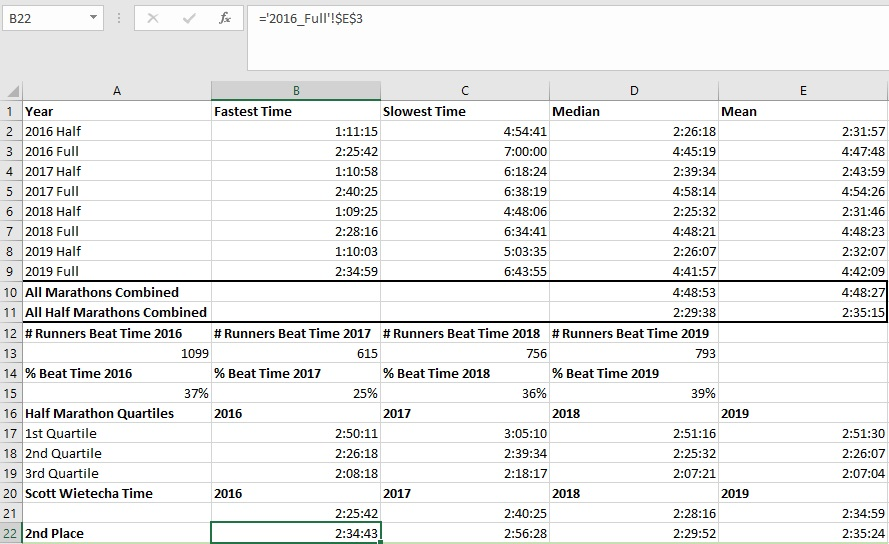

17. For this step I simply subtracted Scott's time from second place's time to find the difference in time for each of the full marathons covered.

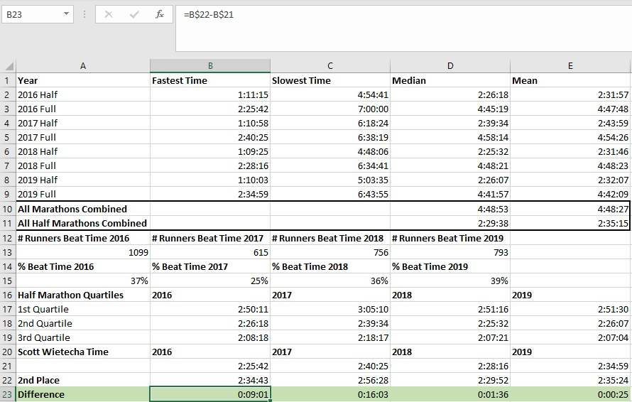

18. Finally, I created a chart showing Scott's time over the past four marathons. The x axis represents each marathon year covered, and the y axis represents marathon times, with a trend line crossing through the chart. There is a spike in 2017 where it took Scott much longer to complete the marathon, and after some research, that summer was one of the hottest ever for the marathon which explains why it took him longer. Lastly, as the years go on, Scott's time is steadily getting slower, but not by much.

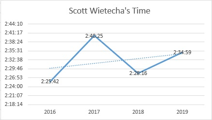